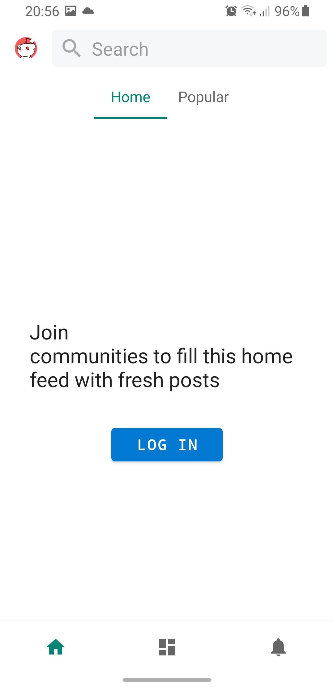

# Ali-For-Reddit
A work in progress Reddit client for android. Developed for learning purposes. 

# Functionality
* Display posts from multiple feed; subscription and popular.
* Comments are displayed in a tree-like structure. Long-press to collapse/expand them. 
* Featuring secure OAuth2 login and Anonymous browsing.
* Supports infinite scrolling.
* Has an offline mode.

# Screenshots

# Video

# Architecture
* The project is built in Kotlin and follows the MVI pattern, and single activity architecture.
* Data fetched from server is stored locally using Room Persistence Library, which serves as a single source of truth.
* Written in test-driven development (TDD) style.
* OAuth 2.0 protocol for authentication and authorization.

# Libraries
* Dagger.
* Rxjava.
* Room.
* FragNav.
* Epoxy.
* Retrofit.
